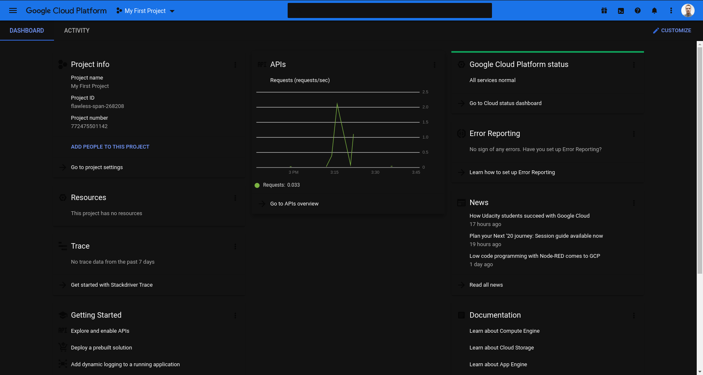
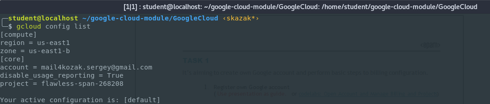
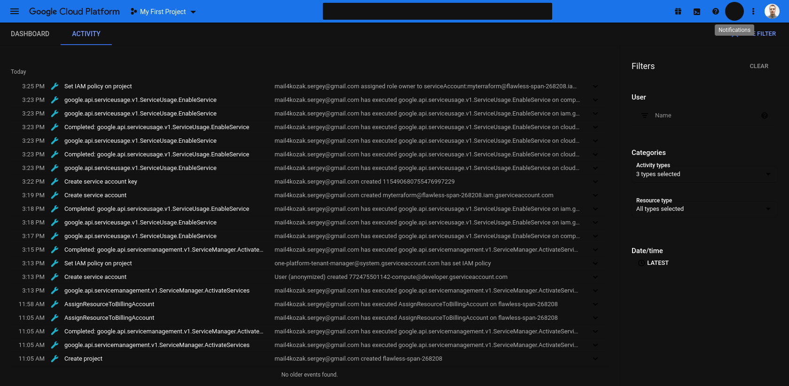
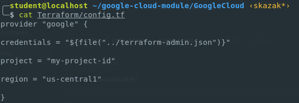
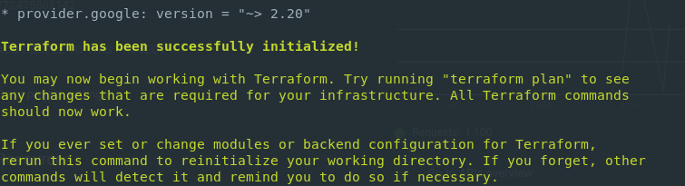

# google-cloud-module - Siarhei Kazak
# Day-1

## Today I've done the following:
### - Activated 12 months free tier on my existed Google Account [✓]
### - Performed Budget configuration [✓]
### - Installed and configureed Google SDK [✓]
### - Completed the lab “Cloud IAM” [✓]
### - Createed Service Account for Terraform [✓]
### - Configured terraform to access GCP via Service Account [✓]

## Attaching a few screenshots

### This is my first GC Project:

### GC config looks like this:

### GC Activity is presented here:

### Terraform config file looks like this:

### Terraform successfully initiated message:

