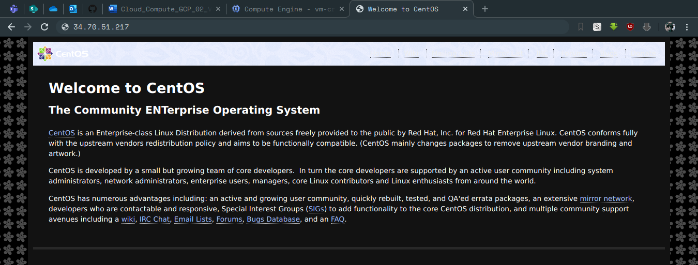

# google-cloud-module - Siarhei Kazak
# Day-2

## Today I've done the following:

## (Task1) Created and pre-configured Virtual Machine in Google cloud by the following ways:
### - gcp-ui
### - gcloud
### - terraform (all settings are provided via variables (tfvars), and URL (“http://IP. Address/” is printed to output )
## (Task2) Updated terraform configuration to add a drive to nginx-tf instance via terraform

## Attaching a few screenshots

### VMs created with 3 different ways:

### VMs provisioned with nginx:

### List of running instances:

### Additional drive for nginx-tf instance:

